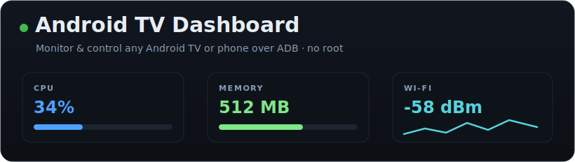
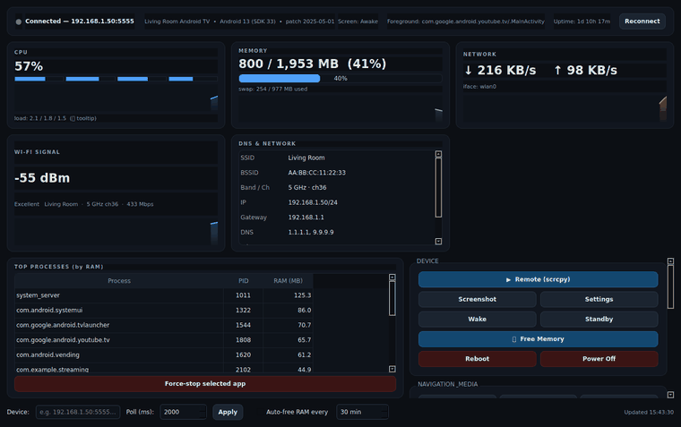

<div align="center">



<br>

<a href="https://github.com/biprodeep/android-tv-dashboard">
</a>

<p>


</p>

</div>

# Android TV Dashboard

**Android TV Dashboard** is a free, open-source **Android TV monitoring and remote control** app for the desktop. It connects to any Android TV, TV box, TV stick, or Android phone through **ADB** (USB or Wi-Fi) and shows **live CPU, RAM, Wi-Fi, network, and process stats**, a DNS and network table, a Bluetooth panel, an on-screen remote, one-click **scrcpy** screen mirroring, screenshots, and power controls. **No root required.**

Built with Python and PySide6, it runs on Windows, macOS, and Linux.

> Keywords: android tv monitor, adb dashboard, android tv remote control pc, scrcpy gui, android performance monitor, no-root android tv tools, fire tv / google tv / mi tv utilities.

## Table of contents

- [Features](#features)
- [Demo](#demo)
- [Requirements](#requirements)
- [Install](#install)
- [Connect your device](#connect-your-device)
- [Run ADB on the device with Termux (self-adb)](#run-adb-on-the-device-with-termux-self-adb)
- [Companion tools](#companion-tools)
- [Remote control with scrcpy](#remote-control-with-scrcpy)
- [Troubleshooting](#troubleshooting)
- [Limitations](#limitations)
- [Project layout](#project-layout)
- [Security](#security)
- [License](#license)

## Features

- **Health header** — connection status, device model, Android version, uptime, screen state, foreground app.
- **CPU** — overall percent, per-core bars, and a rolling sparkline (from `/proc/stat`).
- **Memory** — used vs total plus swap, with a bar and sparkline (from `/proc/meminfo`).
- **Network** — live download/upload throughput with a sparkline (from `/proc/net/dev`).
- **Wi-Fi signal** — RSSI graph plus SSID, band, channel, link speed, and BSSID.
- **DNS & Network table** — DNS servers, Private DNS (DoT) state, gateway, and IP.
- **Top processes** — sorted by RAM, with a one-click force-stop for any app.
- **Bluetooth panel** — adapter state, paired devices, connection status, enable/disable, and a shortcut to the pairing screen.
- **On-screen remote** — D-pad, Back, Home, volume, media keys, Live-TV launch, and an app launcher.
- **scrcpy** — mirror and control the screen with mouse and keyboard in one click.
- **Free Memory** — runs `am kill-all` and `pm trim-caches`, with an optional auto-clean timer.
- **Power & admin** — Wake, Standby, Reboot, Power Off, Screenshot, Settings, Reconnect.

## Demo



*The dashboard running with sample data. Regenerate it any time with `QT_QPA_PLATFORM=offscreen python3 tools/make_demo.py`.*

## Requirements

- **Python 3.9+**
- **`adb`** (Android platform-tools) on your `PATH`
- **`scrcpy`** on your `PATH` (optional, only for the Remote button)
- A graphical environment for the window. On **WSL2**, use WSLg or an X server.

## Install

```bash
git clone https://github.com/biprodeep/android-tv-dashboard.git
cd android-tv-dashboard
pip install -r requirements.txt
python -m tvdash
```

Or use the helper script, which sets up a virtual environment when it can:

```bash
./run.sh
```

## Connect your device

The app speaks to your device over **ADB**. Enable ADB once, connect, then type the device address into the app. The steps are identical for a **TV** or a **phone**.

### Step 1 — Enable Developer Options

- **Phone / general Android:** Settings → **About phone** → tap **Build number** seven times.
- **Android TV / Google TV:** Settings → **System** → **About** → select **Build** (or **Android TV OS build**) and click it **seven times**. A "You are now a developer" message appears.

### Step 2 — Enable USB debugging

Settings → **System** → **Developer options** → turn on **USB debugging**. Many TVs also expose **ADB debugging** and **Wireless debugging** here, which help when the TV has no convenient USB port.

### Step 3 — Connect (pick one)

**3a. Over USB**

```bash
adb devices        # accept the "Allow USB debugging?" prompt on the device (tick "Always allow")
```

**3b. Over Wi-Fi with `adb tcpip` (ideal for TVs)**

Keep the PC and device on the same network.

```bash
adb tcpip 5555                    # after one USB authorization, switch ADB to TCP port 5555
adb connect 192.168.1.50:5555     # use your device's IP (Settings -> Network -> IP address)
adb devices                       # should list 192.168.1.50:5555  device
```

`adb tcpip` mode resets to USB after a reboot, so re-run `adb tcpip 5555` or use Wireless debugging below.

**3c. Wireless debugging (Android 11+, pairing code)**

Developer options → **Wireless debugging** → **Pair device with pairing code**, then:

```bash
adb pair 192.168.1.50:37123       # enter the 6-digit code shown on the device
adb connect 192.168.1.50:38745    # use the IP:port from the Wireless debugging screen
```

### Step 4 — Run the dashboard

```bash
python -m tvdash
```

Type your device address (for example `192.168.1.50:5555`, or a USB serial from `adb devices`) into the **Device** field at the bottom and click **Apply**. The status dot turns green on connect.

## Run ADB on the device with Termux (self-adb)

A normal app can gain the ADB shell's privileges **without root** by connecting the device to **its own ADB daemon over loopback**. This is how the companion RAM cleaner runs privileged commands on-device.

In **[Termux](https://termux.dev/)** on the device:

```bash
pkg update -y && pkg install -y android-tools     # provides adb
# the device's adbd must be listening on TCP (run "adb tcpip 5555" once from a PC, or use a dev-options toggle)
adb connect 127.0.0.1:5555                         # connect to the device itself
# accept the on-screen "Allow wireless debugging?" prompt (tick "Always allow")
adb -s 127.0.0.1:5555 shell id                     # uid=2000(shell): privileged
adb -s 127.0.0.1:5555 shell am kill-all            # for example, free background RAM
```

Once authorized, anything the ADB shell can do (`am`, `pm`, `settings`, `dumpsys`) is available to scripts in Termux, no root needed.

## Companion tools

Found in `companion/`:

- **`tv-autoclean.sh`** — a PC-side loop that frees RAM and caches on the device over ADB at a set interval.

  ```bash
  ./companion/tv-autoclean.sh 192.168.1.50:5555 1800        # every 30 minutes
  nohup ./companion/tv-autoclean.sh 192.168.1.50:5555 1800 >/tmp/clean.log 2>&1 &
  pkill -f tv-autoclean.sh
  ```

- **`termux/clearram.sh`** — the same idea running **on the device** via self-adb (loopback). Copy it into Termux and run `sh clearram.sh 1800`. `termux/boot/10-clearram.sh` starts it at boot when the **Termux:Boot** addon is installed.

Android manages memory on its own, so clearing every 30 to 60 minutes is plenty. Clearing too often only forces apps to cold-start again.

## Remote control with scrcpy

Click **▶ Remote (scrcpy)**, or run `scrcpy -s <ip:port>`. It mirrors the screen and accepts mouse and keyboard over the same ADB link, with nothing extra to install on the device.

## Troubleshooting

| Symptom | Fix |
|---|---|
| `unauthorized` in `adb devices` | Accept the debugging prompt on the device and tick "Always allow". |
| `offline` or dropped connection | `adb disconnect && adb connect <ip>:5555`; confirm both are on the same network. |
| Connection gone after reboot | `adb tcpip` resets on reboot. Re-run `adb tcpip 5555` or use Wireless debugging. |
| GPU or temperature show **N/A** | These read sysfs paths many locked devices block without root. Expected behaviour. |
| Screenshot is blank for video | DRM apps, HDMI inputs, and tuner/Live-TV render on a protected plane that cannot be captured. |
| Load average looks huge | Some TV chipsets inflate load average with driver threads in uninterruptible sleep. Use the CPU percent instead. |

## Limitations

- **No root is assumed.** Features that need root (GPU load and thermal on locked devices, dropping page cache) report **N/A** instead of showing fabricated numbers.
- **Protected video** (DRM apps, HDMI inputs, tuner/Live-TV) cannot be screenshotted or mirrored.
- The Bluetooth panel **manages the device's own adapter** over ADB. The app does not connect to the device over Bluetooth, because ADB has no Bluetooth transport.

## Project layout

```
tvdash/
  adb.py         ADB wrapper (snapshot command, control actions)
  collectors.py  parse /proc + ps + dumpsys, compute CPU% and rates
  worker.py      background polling thread
  widgets.py     Sparkline widget
  app.py         main window, UI, control handlers
  __main__.py    entry point  ->  python -m tvdash
companion/       optional helper scripts (PC-side and Termux self-adb)
docs/            banner and screenshots
```

## Security

ADB access is powerful: anyone who can reach the open port on your device, once authorized, can control it. Enable ADB over the network only on trusted LANs, and turn off Wireless or Network debugging when you are done. Never commit private keys or device-specific addresses.

## Contributing

Issues and pull requests are welcome. Keep changes no-root-friendly and avoid committing any device-specific data (IP addresses, serials, keys, or screenshots).

## License

[MIT](LICENSE) © 2026 **Biprodeep Roy**
